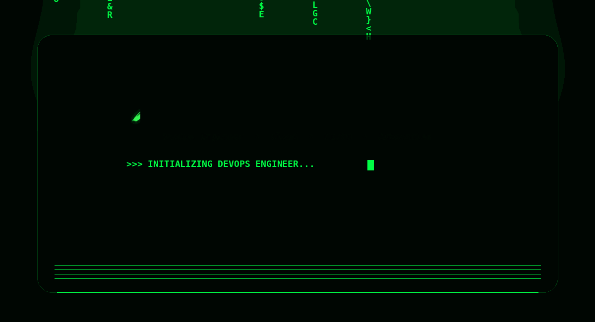

 

## 👨‍💻 About Me

Computer Science Graduate and **DevOps Engineer** focused on cloud
infrastructure, containerization, CI/CD, and deployment automation. I
combine software engineering experience with modern infrastructure
practices to build reliable and repeatable delivery workflows.

------------------------------------------------------------------------

## ⚙️ DevOps & Cloud

  
  
  
  
  
  
  
  
  
  

------------------------------------------------------------------------

## 💻 Development & Web3

  
  
  
  
  
  
  

------------------------------------------------------------------------

## 🤝 Connect

  
  

 

`Automate. Deploy. Operate.`

 

